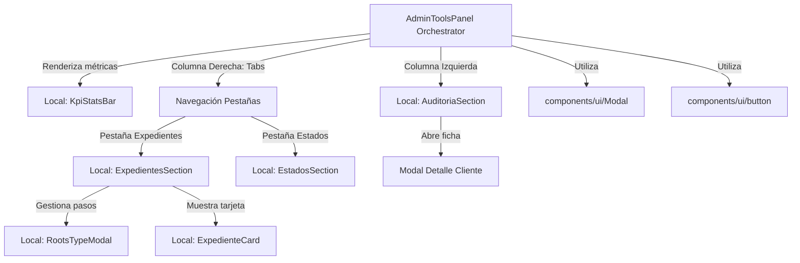

# AdminToolsPanel (Referencia Técnica)

El panel administrativo `AdminToolsPanel` actúa como el **orquestador unificado** para la gestión integral de expedientes, auditoría de clientes y configuración de estados de la plataforma Impulsar. Tras la refactorización modular, el componente principal delega el renderizado a subcomponentes especializados y locales.

## Arquitectura de Composición Jerárquica



## Subcomponentes Locales e Interfaces de Props

### 1. `KpiStatsBar`
* **Archivo**: `src/components/dashboard/AdminToolsPanel/KpiStatsBar.tsx`
* **Props**:
  ```typescript
  interface KpiStatsBarProps {
    clients: ClientData[];
    rootsTypes: RootsType[];
  }
  ```
* **Responsabilidad**: Muestra 3 KPIs globales: Clientes Registrados, Expedientes Activos y Progreso Promedio.

### 2. `AuditoriaSection`
* **Archivo**: `src/components/dashboard/AdminToolsPanel/AuditoriaSection.tsx`
* **Props**:
  ```typescript
  interface AuditoriaSectionProps {
    clients: ClientData[];
    rootsTypes: RootsType[];
    actionLoading: string | null;
    onAssignRootsType: (userId: string, value: string) => void;
    onSelectClient: (client: ClientData) => void;
    searchQuery: string;
    setSearchQuery: (query: string) => void;
    filterRootsType: string;
    setFilterRootsType: (filter: string) => void;
  }
  ```
* **Responsabilidad**: Renderiza la búsqueda, filtros y grilla de clientes agrupados por expediente. Propaga el evento de selección de cliente al orquestador para abrir el modal detallado.

### 3. `ExpedientesSection`
* **Archivo**: `src/components/dashboard/AdminToolsPanel/ExpedientesSection.tsx`
* **Props**:
  ```typescript
  interface ExpedientesSectionProps {
    rootsTypes: RootsType[];
    loading: boolean;
    onActiveRt: (rt: RootsType) => void;
    onStartEdit: (rt: RootsType) => void;
    onDeleteRt: (id: number) => void;
    onCreateClick: () => void;
  }
  ```
* **Responsabilidad**: Cuadrícula de tarjetas `ExpedienteCard`. Delega todas las acciones al orquestador.

### 4. `EstadosSection`
* **Archivo**: `src/components/dashboard/AdminToolsPanel/EstadosSection.tsx`
* **Props**:
  ```typescript
  interface EstadosSectionProps {
    statusConfigs: StatusConfig[];
    loading: boolean;
    onEditStatus: (config: StatusConfig) => void;
    onDeleteStatus: (id: string) => void;
  }
  ```
* **Responsabilidad**: Cuadrícula de tarjetas de estados con previsualización en vivo de badges. Protege los 4 estados de sistema (`Pending`, `Uploaded`, `Approved`, `Rejected`) de la eliminación.

### 5. `ExpedienteCard`
* **Archivo**: `src/components/dashboard/AdminToolsPanel/ExpedienteCard.tsx`
* **Props**:
  ```typescript
  interface ExpedienteCardProps {
    rootsType: RootsType;
    onClick: () => void;
    onEdit: (e: React.MouseEvent) => void;
    onDelete: (e: React.MouseEvent) => void;
  }
  ```

### 6. `RootsTypeModal`
* **Archivo**: `src/components/dashboard/AdminToolsPanel/RootsTypeModal.tsx`
* **Props**:
  ```typescript
  interface RootsTypeModalProps {
    rootsType: RootsType;
    allSteps: Step[];
    onClose: () => void;
    onToggleStep: (stepId: number, isAssociated: boolean) => void;
    onCreateStep: (name: string, description: string, isMandatory: boolean, shortOrder: number) => void;
    onUpdateStep: (stepId: number, name: string, description: string, isMandatory: boolean, shortOrder: number) => void;
    onReorderSteps: (stepIds: number[]) => void;
  }
  ```

## Server Actions Empleadas

El orquestador invoca de forma asíncrona (agrupadas con `Promise.all` en `fetchData`):
- `getRootsTypesAction()`, `getStepsAction()`, `getUsersAction()`, `getStatusConfigsAction()` — carga inicial.
- `createRootsTypeAction()`, `updateRootsTypeAction()`, `deleteRootsTypeAction()` — CRUD de expedientes.
- `associateStepAction()`, `disassociateStepAction()`, `updateAssociationAction()`, `reorderStepsAction()`, `createStepAction()`, `updateStepAction()` — gestión de pasos.
- `assignRootsTypeToUserAction()` — asignación de expediente a cliente.
- `getStatusConfigsAction()`, `saveStatusConfigAction()`, `deleteStatusConfigAction()` — configuración de estados.
- `updateUserStepStatusAction()` — actualización de estado de paso por cliente.

## Estado Compartido del Orquestador

| Estado | Tipo | Propósito |
|--------|------|-----------|
| `configTab` | `'expedientes' \| 'estados'` | Pestaña de configuración activa en la segunda columna |
| `selectedClient` | `ClientData \| null` | Cliente activo en el modal de detalle |
| `activeRt` | `RootsType \| null` | Expediente activo en el modal de pasos |
| `editingRt` | `RootsType \| null` | Expediente en edición de detalles |
| `isStatusFormOpen` | `boolean` | Modal de crear/editar estado |
